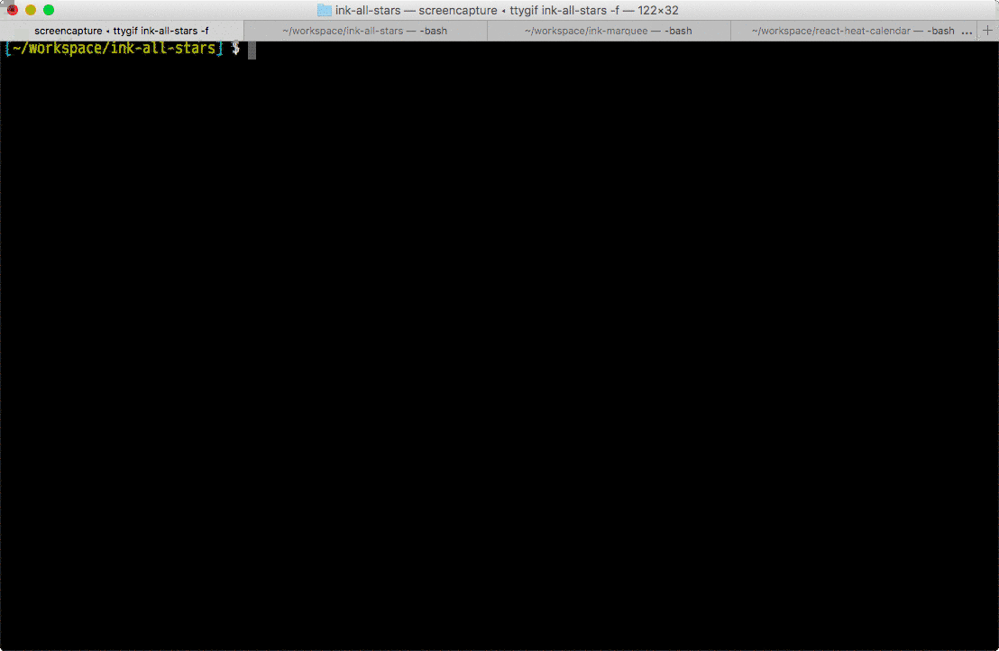

# ink-all-stars

Demo app for ink.

This app uses following components.

* [ink-redux](https://github.com/vadimdemedes/ink-redux) by vadimdemedes
* [ink-text-input](https://github.com/vadimdemedes/ink-text-input) by vadimdemedes
* [ink-password-input](https://github.com/vadimdemedes/ink-password-input) by vadimdemedes
* [ink-progress-bar](https://github.com/brigand/ink-progress-bar) by brigand
* [ink-spinner](https://github.com/vadimdemedes/ink-spinner) by vadimdemedes
* [ink-checkbox-list](https://github.com/MaxMEllon/ink-checkbox-list) by MaxMEllon
* [ink-marquee](https://github.com/y-takey/ink-marquee) by y-takey(me)
* [ink-flower](https://github.com/y-takey/ink-flower) by y-takey(me)

LICENSE
---

MIT © 2017 y-takey
